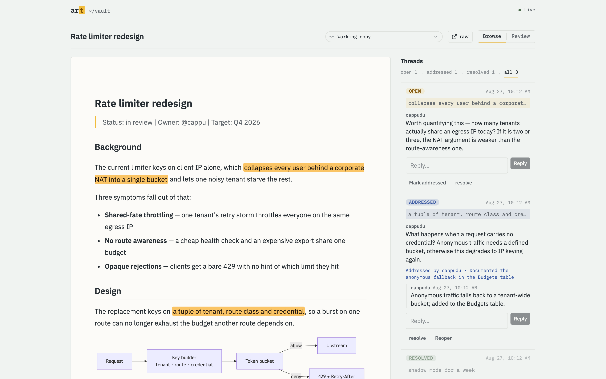
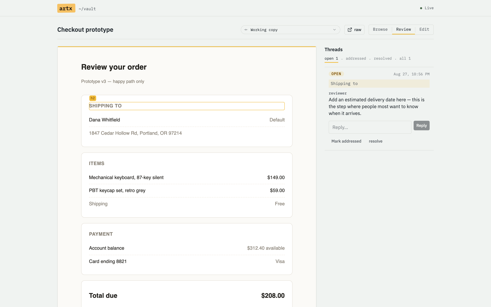
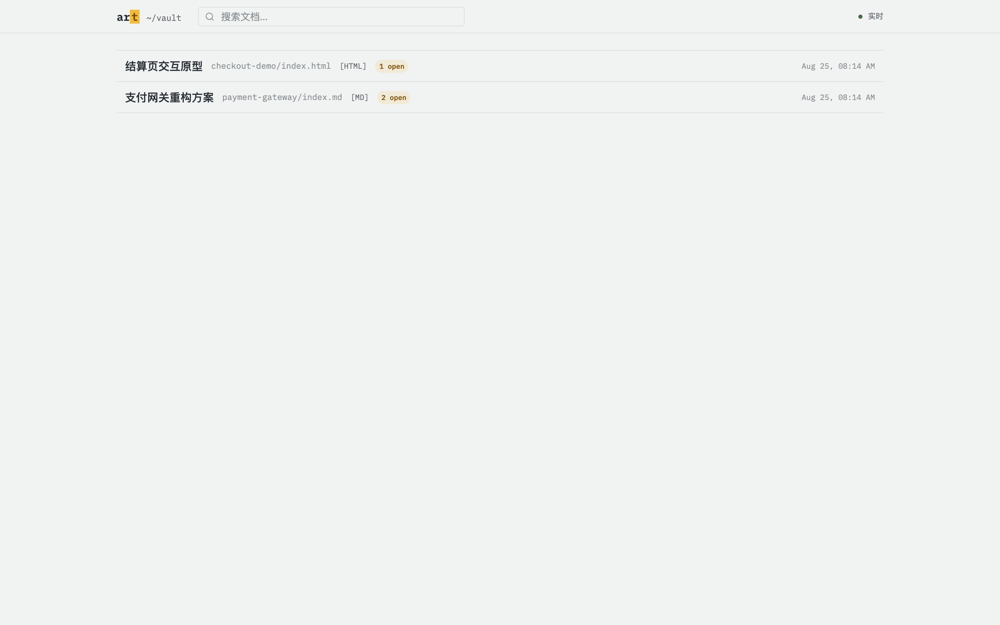

# artx

[](LICENSE)
[](go.mod)
[](#platform-support)

**A local review loop between you and your coding agent.** The agent publishes a design doc or an HTML demo; you read it in a browser and comment on the exact sentence or element you mean; the agent reads those comments from the CLI, fixes them, and marks them handled. Everything lives as plain files in a git repo.

Agents are good at producing plans and prototypes and bad at knowing which paragraph you disliked. `artx` closes that gap without a SaaS, an account, or a database.

---

## How it works

```
          AGENT                                          HUMAN
            │                                              │
   artx new payment-gateway                                 │
   writes index.md                                         │
            │ ───────────────  url  ─────────────────────▶ │
            │                                     reads at 127.0.0.1:7777
            │                                     selects a sentence, comments
            │ ◀────────────  anchored thread  ───────────  │
   artx comments --open --json                              │
   edits the document                                      │
   artx reply / artx addressed                               │
            │ ────────────  live, over SSE  ─────────────▶ │
            │                                     artx resolve
```

Three properties make the loop hold together:

- **Comments are anchored, not line-numbered.** A thread points at quoted text (W3C-style `TextQuoteSelector` plus a byte-offset hint). When the document changes, a file watcher diffs it and shifts every open anchor to its new position. If the anchored text is gone, the thread is marked `orphan` and keeps the text it used to point at, so the agent can tell you what feedback it can no longer locate.
- **The filesystem is the database.** An artifact is a directory with an `index.md` or `index.html`. Comments are an append-only YAML event log next to it. Any tool can read or write vault files directly without corrupting anything.
- **git is the sync layer.** There is no server to run and nothing to sign up for. Push the vault, and comments travel with it.

---

## Screenshots

A markdown artifact under review. Anchored text is highlighted in place on the left; the sidebar on the right holds the threads, filtered by status (`open` / `addressed` / `resolved`), each with its replies and the actions that move it along:



An HTML demo, loaded in a sandboxed iframe. Hovering outlines block elements; clicking one opens a comment box anchored to that element's `data-aid`:



The vault index, with open-comment counts per artifact:



---

## Quick start

### Install

Build from source (only supported install method today):

```bash
git clone https://github.com/six-ddc/artx
cd artx
make build          # builds the web UI with pnpm, then the Go binary
cp bin/artx /usr/local/bin/
```

Requires Go 1.24+, Node 22+, and pnpm. To build the binary alone against a placeholder UI — useful when hacking on the Go side — run `make go-build`.

> **TODO** — `brew install artx` and prebuilt release binaries are not available yet.

### Use

```bash
artx init ~/vaults/work        # git init + directory skeleton + AGENTS.md
cd ~/vaults/work
artx serve --open              # http://127.0.0.1:7777
```

Then, from wherever the agent works:

```console
$ artx new payment-gateway --type md --json
{
  "id": "a7f3k2",
  "path": "/Users/you/vaults/work/payment-gateway/index.md",
  "url": "http://127.0.0.1:7777/a/a7f3k2",
  "slug": "payment-gateway",
  "type": "md"
}
```

The agent writes the file at `path` with its own editing tools — `artx` deliberately offers no content I/O — and hands you the `url`. You comment in the browser. The agent picks the comments up with `artx comments --open --json`.

---

## Commands

Every agent-facing command takes `--json`. Exit codes are meaningful: `0` success, `1` error, `2` not found.

| Command | What it does |
|---|---|
| `artx init [dir]` | Create a vault: directory skeleton, `git init`, `.gitattributes`, `.gitignore`, `AGENTS.md` |
| `artx new <slug> --type md\|html` | Allocate a doc id, write the skeleton file, print `{id, path, url}` |
| `artx path <slug\|id>` | Resolve an artifact's absolute path |
| `artx list` | List artifacts with their open-comment counts |
| `artx open [slug\|id]` | Open the index or one artifact in a browser |
| `artx serve` | Serve the vault: reading, commenting, SSE, file watcher |
| `artx comments [--open\|--all] [--doc <slug>]` | List threads with path, line, offsets, quote and surrounding context |
| `artx reply <thread> <text>` | Append a reply to a thread |
| `artx addressed <thread> [--commit <sha>]` | Mark a thread handled (agents do this; resolving belongs to humans) |
| `artx resolve <thread>` / `artx reopen <thread>` | Close / reopen a thread |
| `artx compact [--doc <slug>]` | Archive resolved threads and collapse edit/remap chains |
| `artx doctor [--fix]` | Check the vault and repair what can be repaired automatically |
| `artx watch --dispatch "<cmd>"` | Run a command whenever a new open comment appears |
| `artx vault add\|list\|use` | Manage the global vault registry |

`artx serve` flags: `--port` (default 7777), `--host` (requires `--token`), `--token`, `--no-watch`, `--open`, `--raw` (skip reviewer-script injection for HTML artifacts that misbehave in the sandbox).

Thread ids accept any unique prefix, so `artx resolve c7k` works.

---

## Agent integration

`artx init` writes an `AGENTS.md` into the vault describing the protocol. Point your agent at it — Claude Code, Codex, and anything else that reads a repo convention file will pick it up. In substance:

- When producing a plan or demo, run `artx new <slug> --type md|html --json`, write the file at the returned `path`, and include the returned `url` in your reply.
- At the start of a session, run `artx comments --open --json` and work through each thread: edit the document, `artx reply <thread> "<what changed>"`, then `artx addressed <thread> --commit <sha>`.
- Do not resolve threads yourself. Resolving belongs to the human.
- For `orphan` threads, check whether the original feedback is already satisfied, explain in a reply, and ask the human to confirm.
- `data-aid` attributes and the `aid` frontmatter key are system identifiers. Preserve them when editing.

`artx comments --open --json` gives the agent everything it needs to locate the feedback without guessing:

```json
[
  {
    "thread": "cvgbny",
    "doc": "a7f3k2",
    "slug": "payment-gateway",
    "path": "/Users/you/vaults/work/payment-gateway/index.md",
    "status": "open",
    "author": "cappu",
    "body": "This paragraph is too verbose; merge it into the previous section",
    "created_at": "2026-08-24T10:12:03+08:00",
    "updated_at": "2026-08-24T10:12:03+08:00",
    "anchor": {
      "kind": "text",
      "exact": "Choosing a payment gateway requires weighing several factors",
      "prefix": "t gateway selection\n\nTherefore, ",
      "suffix": ", including latency and settleme",
      "start": 94,
      "end": 154,
      "line": 8,
      "context": "# Payment gateway selection\n\nTherefore, Choosing a payment gateway requires weighing several factors, including latency and settlement terms.",
      "rev": "93c7e67"
    },
    "replies": []
  }
]
```

`path` and `line` say where to edit, `exact` says what to change, and `context` gives enough surrounding source that the agent does not need to re-read the file to orient itself.

No MCP server is provided. The CLI is the interface; if you need MCP, wrapping these commands takes about twenty lines.

---

## Design notes

The interesting decisions, in brief. Full detail in [`docs/design.md`](docs/design.md) (product) and [`docs/blueprint.md`](docs/blueprint.md) (implementation).

**The filesystem is the database.** A vault is a git repo. An artifact is a directory containing `index.md` or `index.html`. Its identity is an immutable 6-character doc id stored in markdown frontmatter (`aid:`) or an HTML `<meta name="aid">`; the path is only an address, so renaming a directory does not orphan its comments.

**git is the sync layer.** Comment files carry `merge=union` in `.gitattributes`. Two machines appending events to the same document converge on `git pull` without a merge conflict, because every writer only ever appends a complete block at the end of the file.

**Comments are an append-only YAML event log.** Each document has one event stream at `.artx/comments/<docid>.yaml`; a thread's current state is `fold(all events)`. Creating, replying, editing, marking addressed, resolving, remapping — all of it is an appended event. YAML rather than JSONL because these files are first-class vault citizens: you can read them, and read their diffs. Compaction is the only operation permitted to rewrite a file, and it commits separately so history stays recoverable.

**Anchors are W3C-style, with remapping.** A markdown anchor is a `TextQuoteSelector` (exact text plus ~32 characters of prefix and suffix) with a byte-offset `TextPositionSelector` as an acceleration hint. Go-side goldmark tags every rendered block with `data-sourcepos`, so a browser selection resolves back to a source offset; within a block, the quote does the precise positioning. On every file change the watcher diffs the previous git revision against the new content, shifts open anchors through the diff, and verifies the quote — falling back to bitap fuzzy search, and to `orphan` if the text is genuinely gone.

**One writer at a time.** When `artx serve` is running it is the only process writing to comment files; the CLI probes for it via a lockfile and routes writes to its HTTP API. Without a running serve, the CLI appends directly while holding an advisory `flock`. Across machines, git handles it.

---

## Platform support

macOS and Linux. Windows is not supported: comment-file mutual exclusion relies on BSD `flock`, whose semantics on macOS and Linux are identical and — critically — which the kernel releases automatically when a process dies. The serve liveness probe is built on exactly that property.

---

## Contributing

See [CONTRIBUTING.md](CONTRIBUTING.md). In short: `make check` must pass, new code comes with tests, and the field names in `internal/api` and `web/src/lib/{types,protocol}.ts` are a frozen cross-language contract.

## Security

`artx serve` binds `127.0.0.1` by default and refuses to start on a non-local address without `--token`. See [SECURITY.md](SECURITY.md).

## License

[Apache-2.0](LICENSE)
